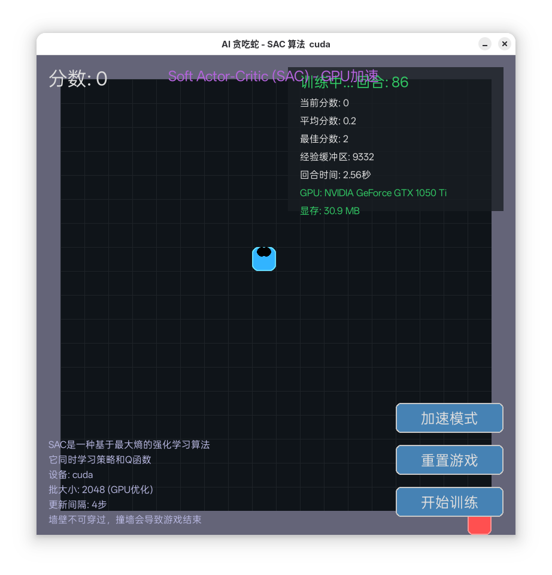

# AI Snake Game with SAC Algorithm



An AI-powered Snake game implementation using the Soft Actor-Critic (SAC) reinforcement learning algorithm with GPU acceleration.

## Table of Contents
- [Features](#features)
- [Requirements](#requirements)
- [Installation](#installation)
- [Usage](#usage)
- [Training](#training)
- [Results](#results)
- [Technical Details](#technical-details)
- [License](#license)
- [中文说明](#中文说明)

## Features

- 🚀 **SAC Algorithm**: State-of-the-art reinforcement learning algorithm with maximum entropy objective
- ⚡ **GPU Acceleration**: Leverages PyTorch CUDA support for faster training
- 🎮 **Interactive UI**: Real-time visualization of training process
- 📊 **Training Statistics**: Tracks scores, averages, and performance metrics
- ⚙️ **Customizable Parameters**: Adjustable hyperparameters for experimentation
- 🖥️ **Visualization**: Colorful game interface with snake and food rendering

## Requirements

- Python 3.10+
- PyTorch (with CUDA if available)
- Pygame
- NumPy

## Installation

1. Clone this repository:
   ```bash
   git clone https://github.com/XK-Byte/Snake-AI.git
   cd Snake-AI
   ```


## Usage

Run the game with default settings:
```bash
python snake_sac.py
```

Controls:
- **Start/Stop Training**: Click the "Start Training" button
- **Reset Game**: Click the "Reset Game" button
- **Speed Mode**: Toggle between fast training and normal speed

## Training

The SAC agent will automatically:
1. Collect experiences through gameplay
2. Update its neural networks periodically
3. Save model checkpoints every 100 episodes

Key hyperparameters (can be adjusted in code):
- Learning rate: 3e-4
- Batch size: 2048
- Replay buffer size: 4,000,000
- Gamma (discount factor): 0.99
- Tau (soft update coefficient): 0.005

## Results

Expected performance:
- Starts learning basic behaviors within 50 episodes
- Achieves consistent scores >20 after 200 episodes
- Can reach scores >50 with sufficient training

## Technical Details

### State Representation
The agent observes:
- Snake head position
- Food position (relative)
- Danger directions (wall/body collisions)
- Current movement direction

### Reward Structure
- +10 for eating food
- -10 for collisions
- Small penalties for inefficient movement
- Time penalty for not eating

### Network Architecture
- Policy Network: 2 hidden layers (512 units each)
- Q Networks: 2 hidden layers (512 units each)
- Activation: ReLU
- Optimization: Adam

## License

MIT License

## 中文说明

# 基于SAC算法的AI贪吃蛇游戏


使用Soft Actor-Critic (SAC)强化学习算法实现的AI贪吃蛇游戏，支持GPU加速。

## 目录
- [功能特点](#功能特点)
- [系统要求](#系统要求)
- [安装指南](#安装指南)
- [使用说明](#使用说明)
- [训练过程](#训练过程)
- [预期效果](#预期效果)
- [技术细节](#技术细节)
- [许可证](#许可证)

## 功能特点

- 🚀 **SAC算法**: 采用最大熵目标的先进强化学习算法
- ⚡ **GPU加速**: 利用PyTorch CUDA支持加速训练
- 🎮 **交互式界面**: 实时可视化训练过程
- 📊 **训练统计**: 记录分数、平均分和性能指标
- ⚙️ **可调参数**: 可调整超参数进行实验
- 🖥️ **可视化界面**: 彩色游戏界面，渲染蛇和食物

## 系统要求

- Python 3.8+
- PyTorch (推荐支持CUDA版本)
- Pygame
- NumPy

## 安装指南

1. 克隆仓库:
   ```bash
   git clone https://github.com/XK-Byte/Snake-AI.git
   cd Snake-AI
   ```


## 使用说明

使用默认设置运行游戏:
```bash
python snake_sac.py
```

操作控制:
- **开始/停止训练**: 点击"开始训练"按钮
- **重置游戏**: 点击"重置游戏"按钮
- **速度模式**: 切换快速训练和正常速度

## 训练过程

SAC智能体会自动:
1. 通过游戏收集经验
2. 定期更新神经网络
3. 每100轮保存模型检查点

关键超参数(可在代码中调整):
- 学习率: 3e-4
- 批大小: 2048
- 经验回放缓冲区: 4,000,000
- Gamma(折扣因子): 0.99
- Tau(软更新系数): 0.005

## 预期效果

预期表现:
- 50轮内学习基本行为
- 200轮后分数稳定>20
- 充分训练后可达到>50分

## 技术细节

### 状态表示
智能体观察:
- 蛇头位置
- 食物位置(相对坐标)
- 危险方向(墙壁/身体碰撞)
- 当前移动方向

### 奖励结构
- 吃到食物: +10
- 碰撞: -10
- 低效移动: 小惩罚
- 长时间不吃食物: 时间惩罚

### 网络架构
- 策略网络: 2个隐藏层(各512单元)
- Q网络: 2个隐藏层(各512单元)
- 激活函数: ReLU
- 优化器: Adam

## 许可证

MIT许可证
```

This README includes:
1. Project title and screenshot placeholder
2. Bilingual sections (English/Chinese)
3. Clear installation and usage instructions
4. Technical specifications
5. Expected performance metrics
6. License information
7. Visual emoji markers for better readability

You should replace `yourusername` with your actual GitHub username and add a real screenshot.png file to the project directory.
